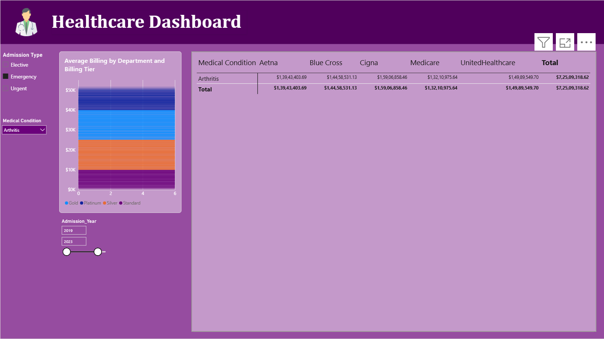
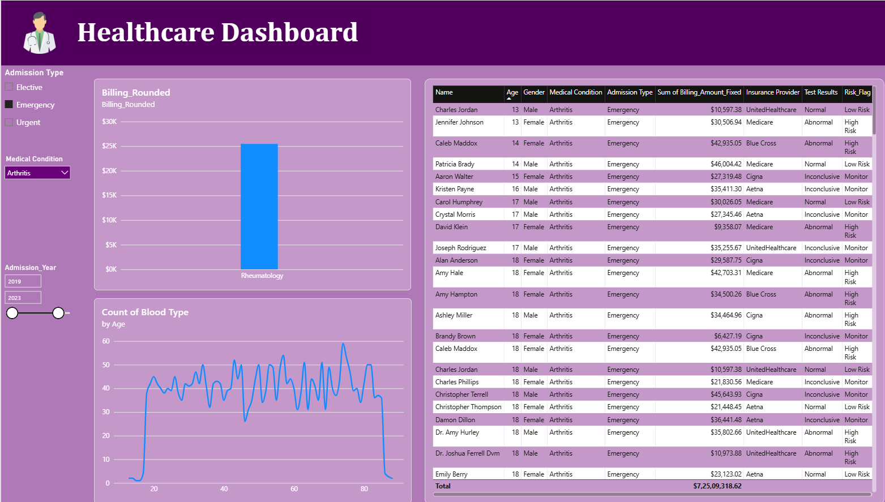
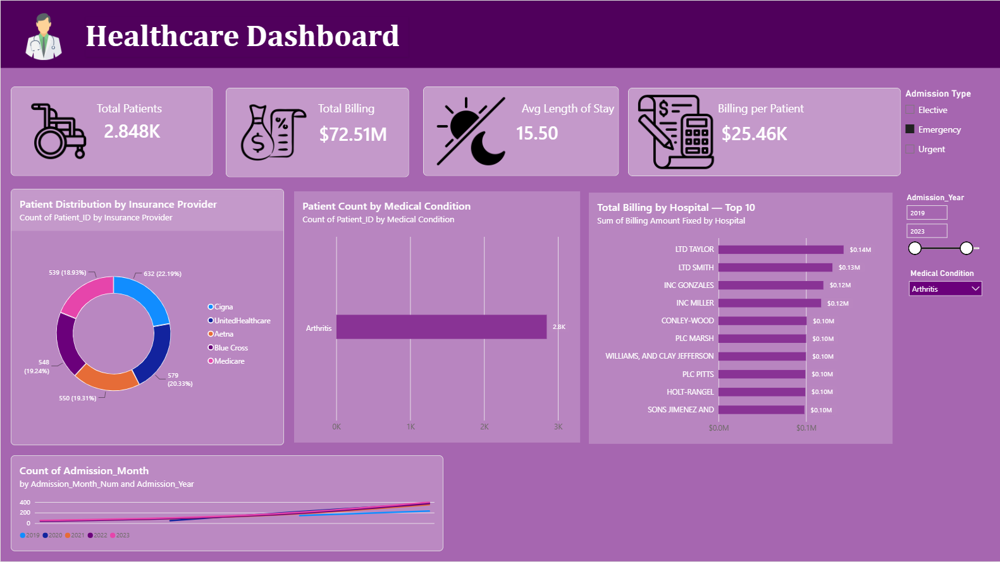

# 🏥 Healthcare Dashboard — Power BI

A professional **Healthcare Analytics Dashboard** built using **Microsoft Power BI** to analyze patient admissions, billing, medical conditions, insurance providers, hospitals, and patient-level risk information.

The dashboard uses interactive filters and multiple report pages to help users explore healthcare data and identify useful business insights.

---

## 📊 Dashboard Preview

### 1. Healthcare Overview



The overview page provides a high-level summary of the healthcare dataset with KPI cards and interactive visualizations.

**Key KPIs:**
- 👥 Total Patients: **2.848K**
- 💰 Total Billing: **$72.51M**
- 🛏️ Average Length of Stay: **15.50**
- 💳 Billing per Patient: **$25.46K**

**Visuals included:**
- Patient Distribution by Insurance Provider
- Patient Count by Medical Condition
- Total Billing by Hospital — Top 10
- Admission Count by Month and Year
- Admission Type filter
- Medical Condition filter
- Admission Year range filter

---

### 2. Patient Details & Billing Analysis



This page provides a detailed patient-level view along with billing and demographic analysis.

**Visuals included:**
- Billing Rounded by Department
- Count of Blood Type by Age
- Detailed patient table
- Admission Type filter
- Medical Condition filter
- Admission Year filter

The patient table contains information such as:
- Patient Name
- Age
- Gender
- Medical Condition
- Admission Type
- Billing Amount
- Insurance Provider
- Test Results
- Risk Flag

---

### 3. Department & Insurance Billing Analysis


This page focuses on billing analysis across departments, billing tiers, medical conditions, and insurance providers.

**Visuals included:**
- Average Billing by Department and Billing Tier
- Medical Condition vs Insurance Provider billing matrix
- Total billing by insurance provider
- Interactive Admission Year and Medical Condition filters

---

## 🎯 Project Objectives

The main objectives of this dashboard are to:

- Analyze patient admission patterns
- Understand healthcare billing performance
- Compare insurance provider contributions
- Identify high-billing hospitals
- Analyze medical conditions and patient counts
- Explore patient demographics
- Monitor patient risk flags
- Compare billing across departments and billing tiers
- Provide interactive and easy-to-understand healthcare insights

---

## 🗂️ Dataset

The project is based on a healthcare dataset containing patient, admission, billing, insurance, and medical information.

### Important fields

| Field | Description |
|---|---|
| Patient Name | Patient name |
| Age | Patient age |
| Gender | Patient gender |
| Blood Type | Patient blood group |
| Medical Condition | Diagnosed medical condition |
| Admission Type | Elective, Emergency, or Urgent |
| Admission Date | Patient admission date |
| Discharge Date | Patient discharge date |
| Billing Amount | Patient billing amount |
| Insurance Provider | Patient's insurance provider |
| Hospital | Hospital associated with the admission |
| Test Results | Test result category |
| Risk Flag | Patient risk classification |
| Admission Year | Year of admission |
| Admission Month | Month of admission |
| Department | Hospital department |
| Billing Tier | Billing category |

---

## 🛠️ Tools & Technologies

- **Microsoft Power BI**
- **Power Query**
- **DAX**
- **Data Modeling**
- **CSV Dataset**
- **Interactive Slicers**
- **Power BI Visualizations**

---

## 📈 Key Dashboard Features

### KPI Cards
The dashboard displays important healthcare KPIs at the top for quick monitoring.

### Interactive Filters
Users can filter the dashboard by:
- Admission Type
- Medical Condition
- Admission Year

### Insurance Analysis
The dashboard compares patient distribution and billing across:
- Cigna
- UnitedHealthcare
- Aetna
- Blue Cross
- Medicare

### Hospital Billing
The dashboard highlights the **Top 10 hospitals by total billing**.

### Patient Risk Analysis
Patient records include a risk flag such as:
- Low Risk
- Monitor
- High Risk

### Billing Analysis
Billing is analyzed using:
- Department
- Billing Tier
- Insurance Provider
- Medical Condition

---

## 💡 Key Insights

From the dashboard:

- The dataset contains approximately **2.85K patients**.
- Total billing is approximately **$72.51M**.
- Average patient stay is around **15.5 days**.
- Average billing per patient is approximately **$25.46K**.
- **Arthritis** is displayed as the selected medical condition in the report.
- Insurance providers can be compared using patient distribution and billing analysis.
- The dashboard allows users to investigate patient-level risk and test-result information.
- Hospital billing can be compared using the Top 10 hospital visualization.

> **Note:** Dashboard values change when filters and slicers are applied.

---

## 📁 Project Structure

```text
Healthcare-PowerBI/
│
├── Healthcare_PB.pbix
├── healthcare_dataset.csv
├── Condition_Dept_Lookup(1).csv
├── README.md
│
└── screenshots/
    ├── healthcare-dashboard-overview.png
    ├── healthcare-dashboard-details.png
    └── healthcare-dashboard-analysis.png
```

---

## 🚀 How to Use

1. Download or clone this repository.
2. Open `Healthcare_PB.pbix` using **Microsoft Power BI Desktop**.
3. Make sure the required CSV files are available if the report needs to refresh its data.
4. Use the slicers to filter the dashboard.
5. Navigate through the report pages to explore:
   - Healthcare Overview
   - Patient Details
   - Billing & Insurance Analysis

---

## 🔄 Data Preparation

The data preparation workflow includes:

1. Importing healthcare data into Power BI.
2. Cleaning and transforming data using **Power Query**.
3. Creating calculated columns and measures using **DAX**.
4. Creating relationships between relevant tables.
5. Building KPI cards and visualizations.
6. Adding slicers and interactive filtering.
7. Formatting the dashboard with a consistent healthcare-themed design.

---

## 📌 Power BI Skills Demonstrated

This project demonstrates practical knowledge of:

- Data Import
- Power Query
- Data Cleaning
- Data Transformation
- Data Modeling
- DAX Measures
- KPI Cards
- Slicers
- Bar Charts
- Donut Charts
- Line Charts
- Matrix Tables
- Detailed Tables
- Conditional Formatting
- Drill/filter interactions
- Dashboard UI/UX Design

---

## 👩‍💻 Author

**Disha**

AI • ML • Data Science Student

---

## ⭐ Project

If you find this Power BI project useful, consider giving the repository a ⭐ on GitHub.

---

## 📷 Screenshots

All dashboard screenshots are included in this README so visitors can quickly understand the report design and functionality.

### Overview


### Patient Details


### Billing & Insurance Analysis

